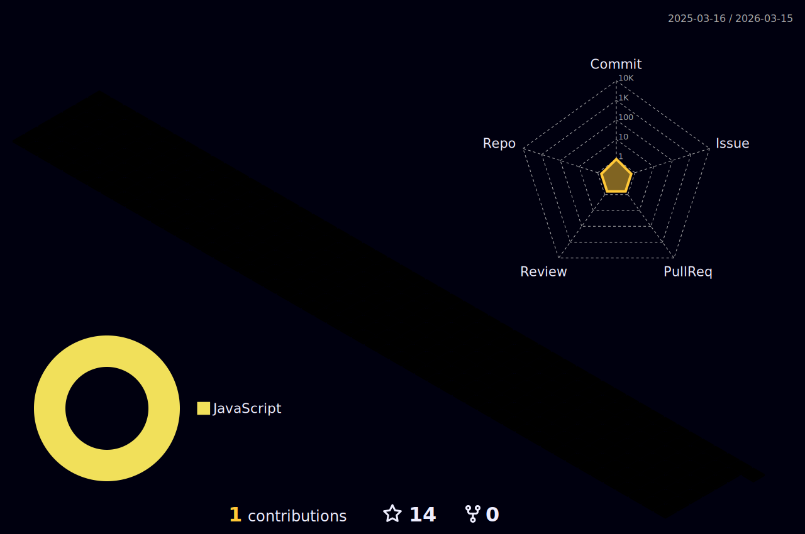

<!--
**Jayromberg/Jayromberg** is a ✨ _special_ ✨ repository because its `README.md` (this file) appears on your GitHub profile.

Here are some ideas to get you started:

- 🔭 I’m currently working on ...
- 🌱 I’m currently learning ...
- 👯 I’m looking to collaborate on ...
- 🤔 I’m looking for help with ...
- 💬 Ask me about ...
- 📫 How to reach me: ...
- 😄 Pronouns: ...
- ⚡ Fun fact: ...
-->

## Olá, me chamo Jayro! 
### Bem vindo ao meu perfil GitHub 👋

- 🌱 Atualmente estou aprendendo Desenvolvimento Web na Trybe.
- 👯 Estou procurando colaborar em equipe, ajudando com monitorias aos finais de semana.
- 💬 Meus hobbies são jogos, animes e séries.
- ⚡ Curiosidade: Sou muito bom no boliche e corrida de kart. (Eu acho! :sweat_smile:)

---

<!--
<a href="https://github.com/Jayromberg">
 

-->

---           
  
### Ferramentas e Tecnologias
          

  

<!-- 
---  
  
 
 
 

#### JavaScript
JavaScript é uma linguagem de programação que permite a você implementar itens complexos em páginas web — toda vez que uma página da web faz mais do que simplesmente mostrar a você informação estática — mostrando conteúdo que se atualiza em um intervalo de tempo, mapas interativos ou gráficos 2D/3D animados, etc. — você pode apostar que o JavaScript provavelmente está envolvido. Fonte: [Mozilla](https://developer.mozilla.org/pt-BR/docs/Learn/JavaScript/First_steps/What_is_JavaScript)
#### TypeScript
Typescript é uma linguagem de código aberto desenvolvida pela Microsoft que foi construída em cima do Javascript, que é muito difundido atualmente. Então esse “superset” foi criado para adicionar recursos de tipagem estáticas à linguagem original.
Em outras palavras, temos todas as funcionalidades do Javascript no Typescript acrescidas de várias outras funcionalidades que caracterizam o Typescript.
Embora Typescript seja um superset do Javascript, na hora de compilar o código, todo Typescript é convertido/transpilado para Javascript. Fonte: [Geek Hunter](https://blog.geekhunter.com.br/introducao-a-typescript/)
-->
  
---                    
       
### Contato

   

  
       
⭐️ Baseado em [Thalles Carneiro](https://github.com/thalles-carneiro) e [Calebe Souza Guimarães](https://github.com/calebesg)
       

